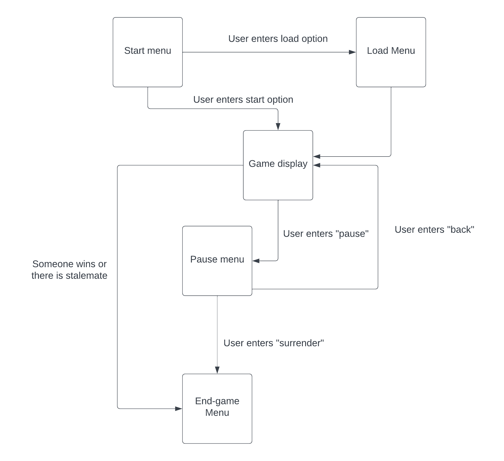
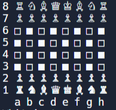
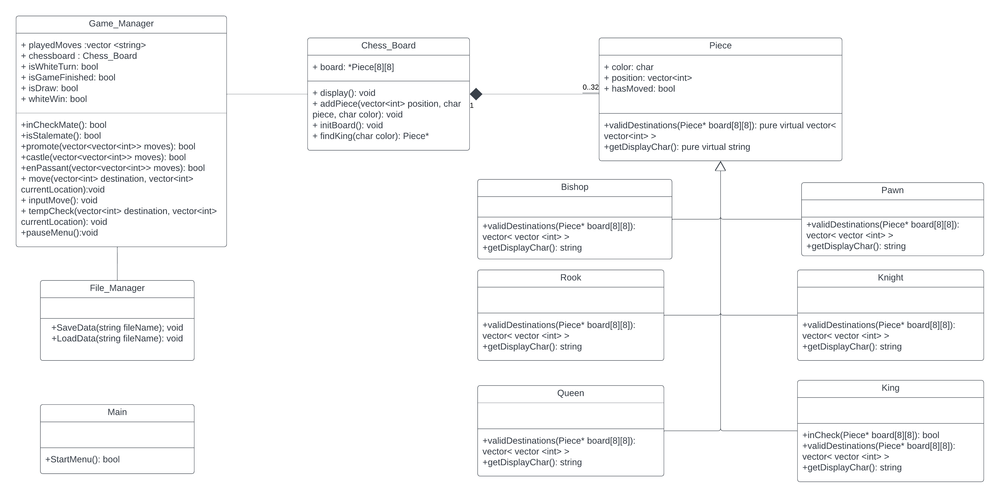
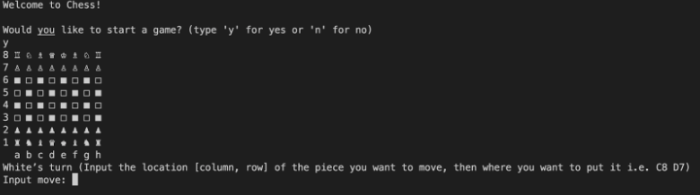
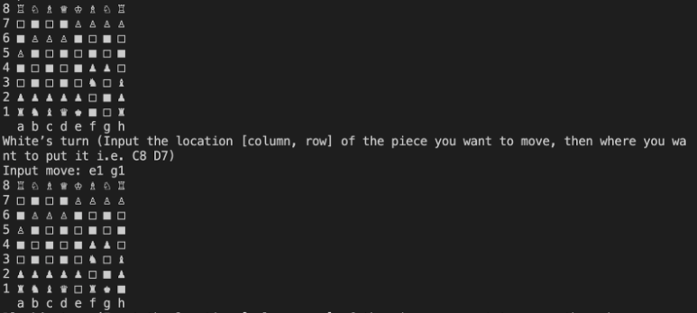
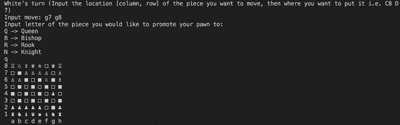
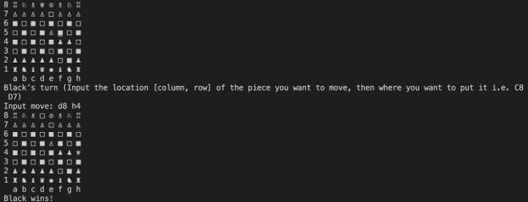
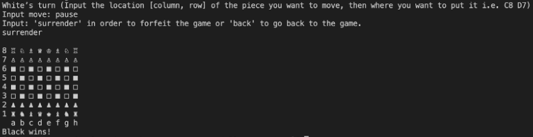

[](https://classroom.github.com/online_ide?assignment_repo_id=10871799&assignment_repo_type=AssignmentRepo)

# Chess Public Portfolio
 Authors: 
 * [Rodrigo Maroto Caño](https://github.com/RodrigoMaroto)
 * [Corey Broussard](https://github.com/cbrou002)
 * [Tristan Dull](https://github.com/Tristancd1)
 * [Peter Natividad](https://github.com/Pnati002)
 

## Project Description
We will be designing and building a terminal-based chess game with two players. This project is important and interesting to us because it is a cool game and we think we’d have a relatively good time doing this over other ideas. We plan to keep the chess game, including all input and output, inside the terminal using C++.  
The user inputs will be in the format of pairs of coordinates of the board (ex. A6 to A7). The initial output would be the board when no moves were made, whose turn it is, and a prompt for the player to make their move. Output would be the chess board after the move was made.  
Some features that should be implemented in the project are:  
* 2 player game
* Fully functioning chess board
* Possibility of saving and reloading games
* Ability to move chess pieces in legal ways
* Ability to determine if a king is in checkmate
* Ability to detect other game-ending states like stalemate.
* Ability to promote a pawn when the conditions match
* Checks to see if the chess piece is in the boundaries of the board.


## User Interface Specification
 

### Navigation Diagram

The start menu is the first menu seen and the next menus you can see are indicated by the arrows in the diagram. The text boxes near the lines represent the inputs needed to get to those screens.

### Screen Layouts
Start Menu:
```text
Welcome to Chess!

Would you like to load a previous game or start a new game?
(Type ‘L’ to load game, ‘N’ for a new game): 
```
Load menu:
```text
What is the file name your game is stored in?
Enter file name:  
```
This file contains the previous moves played as well as the current state of the board. Once the file is inputted the game starts and takes the inputs from the file until there is none left. Essentially replaying the game until the most recent turn.  

Game Display:   
    
```text
White’s turn (Input the location [column, row] of the piece you want to move, then where you want to put it i.e. C8 D7  )  (If you want to pause the game, input “pause” which sends you to a menu):
Input move:

*white’s move is computed then displays the current state of the board after the turn*

Black’s turn (name the location  [column, row] of the piece you want to move, then where you want to put it) (If you want to pause the game, input “pause” which sends you to a menu):
Input move: 
```
(Note: If move was invalid)
```text
Move was invalid, input new move:  
```
Pause menu
```text
input: “surrender” to forfeit and end the game, “back” to go back to the game, or “save” to save the current state of the match along with the previous moves played:


(if inputs “save”)
Please input the name of the file to save the data in: 
```
End-game menu
```text
White/Black Wins!  
```


## Class Diagram
 
 The piece class is going to be used as an abstract class, with each type of piece inheriting from the piece class. Each type of piece will inherit a color, hasMoved and position, and override the getDisplayChar() and validDestinations() functions according to the piece to be moved. The pawn, rook, and king will have a ‘hasMoved’ boolean variable which will be checked when attempting to castle or move two spaces as a pawn. The color of each piece will be either black or white. The validDestinations() function for a specific piece stores a vector of vectors of integers which represents destinations that that piece could move to in one move. 

The Game_Manager class is used to store the previous moves, the board, the results of the game and whose turn it is. It is also used to perform functions for certain cases such as check, stalemate, and checkmate. This class also is used for pawn promotions and other special cases, and saving or loading previous games. It is associated with the Chess_Board class because it cannot do any of its functions without a chess board, and the chess board is useless without the game manager. 

The responsibility of the Game Manager was too large as it was handling both game management and file management, which violated the single responsibility principle. To fix this, we separated the Game Manager class into Game Manager and File Manager classes. This will help us to write better, more readable/manageable code since the separation reduces the complexity of Game Manager without changing the overall functionality.

The move function was initially being implemented for each piece, but the function was similar for all pieces (adjusting pointers on board to reflect new locations). This is a violation of the open-closed principle because the move function should be closed for modification once it is written. In order to fix this, the game manager class is now responsible for the move function, and it is only implemented once. This change allows for more readable code and reduces the amount of duplicated code.
 
 ## Screenshots
 * Game starting  

 
 * Castling 

 
 * Promote  

 
 * Game ending  

 
 * Pause menu  
 
 

 ## Installation/Usage
 We have included the necessary files to build the project using CMake. With this tool you can build the project and run the game with the following commands:
 ```bash
cmake .
make
./bin/chess  
```
Another option for building only the Chess game are the following commands:
 ```bash
g++ src/*.cpp -o chess
./chess  
```
 ## Testing
The project was tested using the GoogleTest framework to write unit tests. Our unit tests cover the methods that do not depend on user input or output.  
These methods include: 
* validDestinations
* getDisplayChar
* Castle
* Stalemate
* Checkmate
* Check  

Additionally, as it is normal when developing projects that depend highly on the user experience like games, we have carried out exhaustive play testing.  
Finally, we have also run the executable using Valgrind to identify memory leaks and fix them. 

The source files for the code are not included, as this is just to give an idea of the project we implemented. I have included the header files for the work we did.
